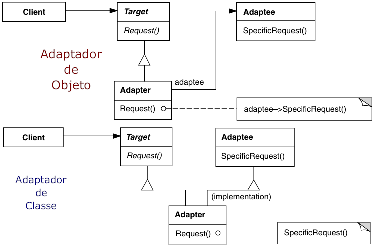
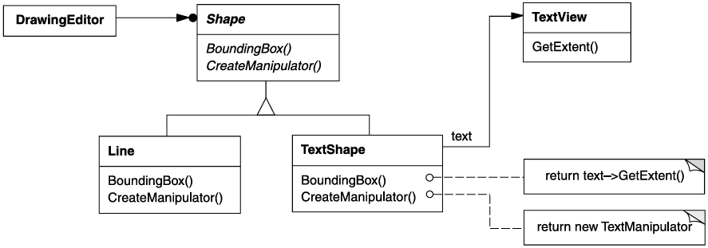
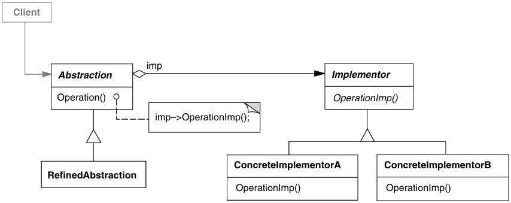
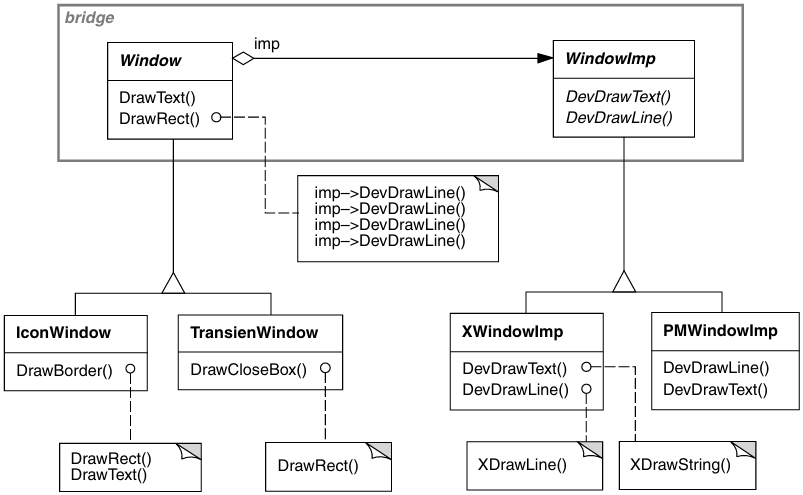
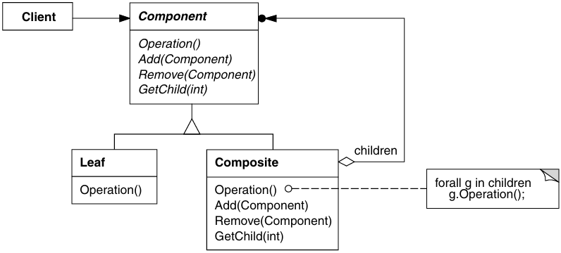
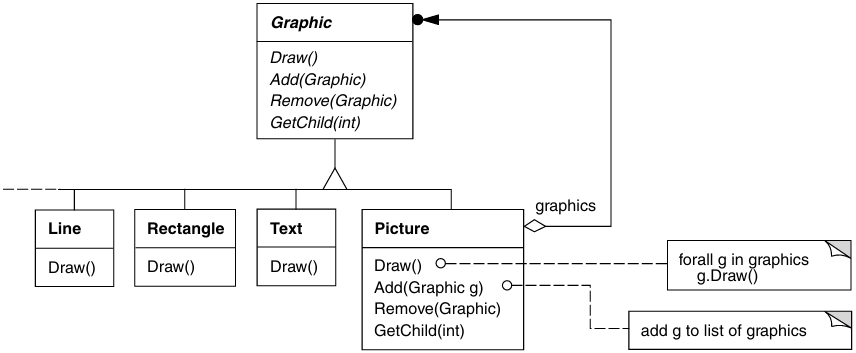
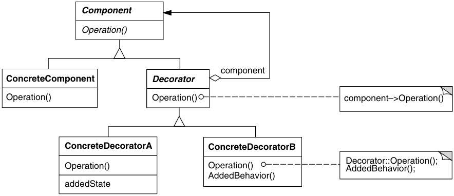
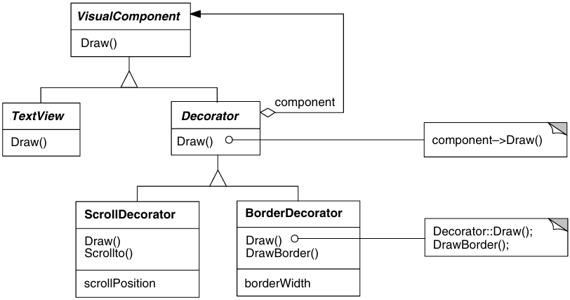
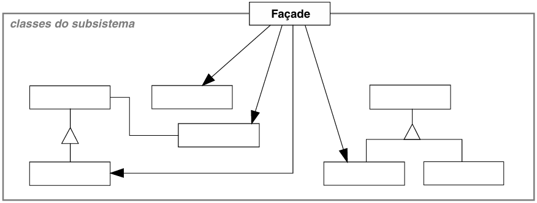
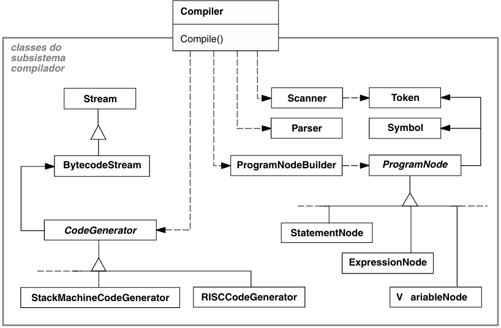

# Padrões Estruturais

Os **Padrões Estruturais** se preocupam com a forma como classes e objetos são compostos para formar estruturas maiores.

Os padrões estruturais **de classes** utilizam a **herança para compor** interfaces ou implementações.

Em lugar de compor interfaces ou implementações, os padrões estruturais **de objetos** descrevem maneiras de **compor objetos para obter novas funcionalidades**. A flexibilidade obtida pela composição de objetos provém da capacidade de mudar a composição em tempo de execução, o que é impossível com a composição estática de classes.

## Adapter (Wrapper)

> Converter a interface de uma classe em outra interface, esperada pelos clientes. O Adapter permite que classes com interfaces incompatíveis trabalhem em conjunto o que, de outra forma, seria impossível.

- **Target**: Define a interface específica do domínio que Client usa.
- **Client**: Colabora com objetos compatíveis com a interface de Target.
  - Chamam operações em uma instância de Adapter.
- **Adaptee**: Define uma interface existente que necessita ser adaptada.
- **Adapter**: Adapta a interface do Adaptee à interface de Target.
  - Chamam operações de Adaptee que executam a solicitação.

## Bridge (Handle/Body)

> Desacoplar uma abstração da sua implementação, de modo que as duas possam variar independentemente.

- **Abstraction**: Define a interface de abstração;
  - Mantém uma referência para um objeto do tipo Implementor;
  - Repassa as solicitações dos clientes para o seu objeto Implementor.
- **RefinedAbstraction**: Estende a interface definida por Abstraction;
- **Implementor**: Define a interface para as classes de implementação.
  - Não precisa corresponder exatamente à Abstraction.
  - Fornece somente operações primitivas, enquanto Abstraction define operações de nível mais alto baseadas nessas primitivas.
- **ConcreteImplementor**: Implementa Implementor e definie sua implementação concreta.

## Composite

> Compor objetos em estruturas de árvore para representarem hierarquias partes-todo. Permite aos clientes tratarem de maneira uniforme objetos individuais e composições de objetos.

- **Component**: declara a interface para os objetos na composição.
  - Implementa comportamento-padrão para a interface comum a todas as classes, conforme apropriado;
  - Declara uma interface para acessar e gerenciar os seus componentes-filhos;
  - Define uma interface para acessar o pai de um componente na estrutura recursiva e a implementa (opcional);
- **Leaf**: Representa objetos sem filhos.
  - Define comportamento para objetos primitivos na composição.
- **Composite**: Define comportamento para componentes que têm filhos.
  - Armazena os componentes-filho;
  - Implementa as operações relacionadas com os filhos presentes na interface de Component;
- **Client**: Manipula objetos através da interface de Component.
  - Se o receptor é um Composite, ele normalmente repassa as solicitações para os seus componentes-filhos, executando operações adicionais antes e/ou depois do repasse.

## Decorator (Wrapper)

> Dinamicamente, agregar responsabilidades adicionais a um objeto. Os Decorators fornecem uma alternativa flexível ao uso de subclasses para extensão de funcionalidades.

- **Component**: Define a interface para objetos que podem ter responsabilidades acrescentadas aos mesmos dinamicamente.
- **ConcreteComponent**: Define um objeto para o qual responsabilidades adicionais podem ser atribuídas.
- **Decorator** Mantém uma referência para um objeto Component e define uma interface que segue a interface de Component.
  - Repassa solicitações para o seu objeto Component.
  - Pode executar operações adicionais antes e depois de repassar a solicitação.
- **ConcreteDecorator**: Acrescenta responsabilidades ao componente.

## Façade

> Fornecer uma interface unificada para um conjunto de interfaces em um subsistema. Define uma interface de nível mais alto que torna o subsistema mais fácil de ser usado.

- **Façade**: Conhece quais as classes do subsistema são responsáveis pelo atendimento de uma solicitação.
  - Delega solicitações de clientes a objetos apropriados do subsistema.
  - Os clientes que usam a Façade não acessam os objetos do subsistema diretamente.
- **Classes de Subsistema**: Implementam a funcionalidade do subsistema;
  - Encarregam-se do trabalho atribuído a elas pelo objeto Façade;
  - Não têm conhecimento da Façade, não mantém referências para a mesma.

