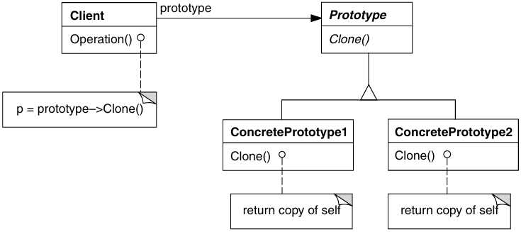

# Padrões Criacionais

Os Padrões Criacionais tratam da criação de objetos de forma flexível e eficiente.

Os padrões de criação abstraem o processo de instanciação. Eles ajudam a tornar um sistema independente de como seus objetos são criados, compostos e representados.

Um padrão de **criação de classe** usa a **herança para variar a classe** que é instanciada, enquanto que um um padrão de **criação de objeto** **delegará a instanciação para outro objeto**.

## Abstract Factory (Kit)

> Fornecer uma interface para criação de famílias de objetos relacionados ou dependentes sem especificar suas classes concretas.

- **AbstractFactory**: Declara uma interface para operações que criam objetos-produto abstratos.
  - Adia a criação dos objetos-produto para as suas subclasses ConcreteFactory.
- **ConcreteFactory**: Implementa as operações que criam objetos-produto concretos.
  - Normalmente uma única instância é criada em tempo de execução. Essa fábrica concreta cria objetos-produto que têm uma implementação particular;
  - Para criar diferentes objetos-produto, os clientes deveriam usar uma fábrica concreta diferente.
- **AbstractProduct**: Declara uma interface para um tipo de objeto-produto.
- **ConcreteProduct**: Define um objeto-produto a ser criado pela correspondente fábrica concreta. Implementa a interface de Abstract Product.
- **Client**: Usa somente interfaces declaradas pelas classes AbstractFactory e AbstractProduct.

## Builder

> Separar a construção de um objeto complexo da sua representação de modo que o mesmo processo de construção possa criar diferentes representações.

- **Builder**: Especifica uma interface abstrata para criação de partes de um objeto-produto.
  - Trata solicitações do diretor e acrescenta partes ao produto.
- **ConcreteBuilder**: Constrói e monta partes do produto pela implementação da interface de Builder,
  - Define e mantém a representação que cria;
  - Fornece uma interface para recuperação do produto (Get_);
- **Director**: Constrói um objeto usando a interface de Builder.
  - Notifica o construtor sempre que uma parte do produto deve ser construída.
- **Product**: Representa o objeto complexo em construção.
  - ConcreteBuilder constrói a representação interna do produto e define o processo pelo qual ele é montado;
  - Inclui classes que definem as partes constituintes, inclusive as interfaces para a montagem das partes no resultado final.

## Factory Method (Virtual Constructor)

> Definir uma interface para criar um objeto, mas deixar as subclasses decidirem que classe instanciar. O Factory Method permite adiar a instanciação para subclasses.

- **Product**: Define a interface de objetos que o método fábrica cria.
- **ConcreteProduct**: Implementa a interface de Product.
- **Creator**: Declara o método fábrica, o qual retorna um objeto do tipo Product.
  - Pode também definir uma implementação por omissão do método factory que retorna por omissão um objeto ConcreteProduct;
  - Pode chamar o método factory para criar um objeto Product;
  - Depende das suas subclasses para definir o método fábrica de maneira que retorne uma instância do ConcreteProduct apropriado.
- **ConcreteCreator** Redefine o método-fábrica para retornar a uma instância de um ConcreteProduct.

## Prototype

> Especificar os tipos de objetos a serem criados usando uma instância-protótipo e criar novos objetos pela cópia desse protótipo.

- **Prototype**: Declara uma interface para clonar a si próprio.
- **ConcretePrototype**: Implementa uma operação para clonar a si próprio.
- **Client**: Cria um novo objeto solicitando a um protótipo que clone a si próprio.
  - Um cliente solicita a um protótipo que este clone a si próprio.

## Singleton

> Garantir que uma classe tenha somente uma instância e fornecer um ponto global de acesso para a mesma.

- **Singleton**: Define uma operação de classe `Instance` que permite aos clientes acessarem sua única instância.
  - Pode ser responsável pela criação da sua própria instância única;
  - Os clientes acessam uma instância Singleton unicamente pela operação `Instance` do Singleton
