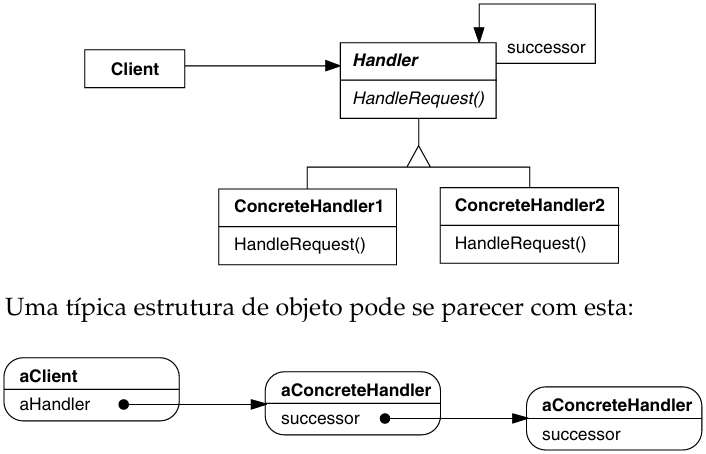
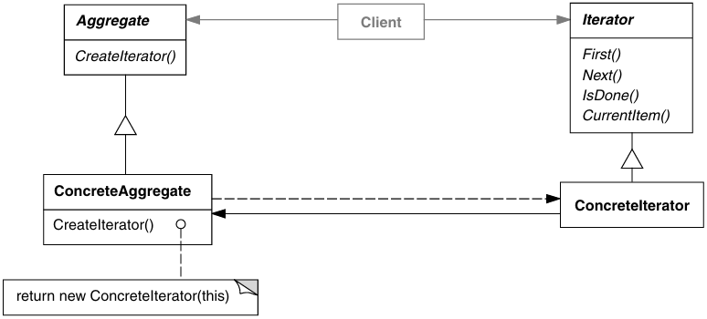
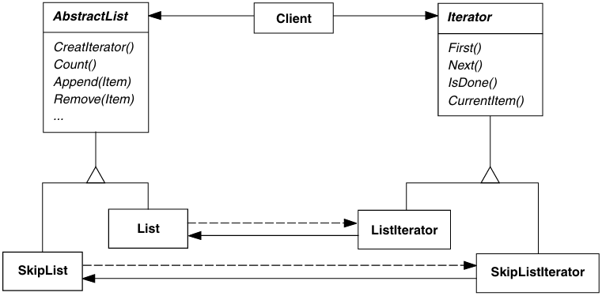
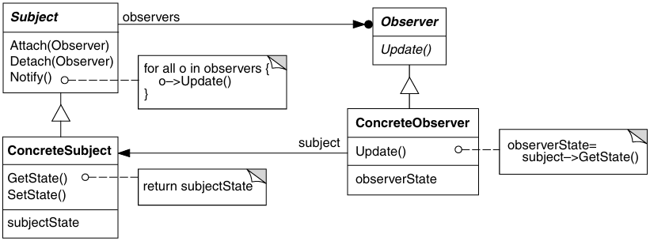
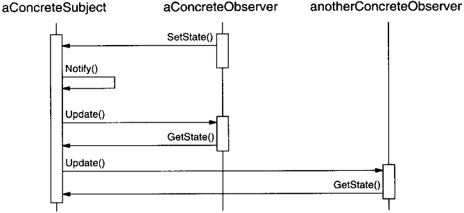
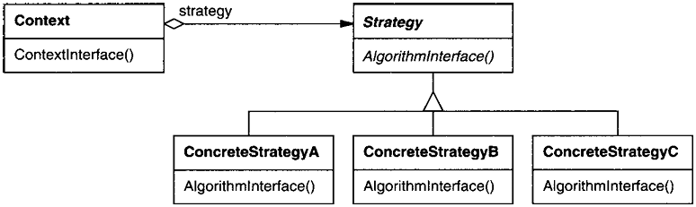
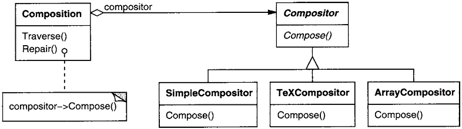

# Padrões Comportamentais

Os **Padrões Comportamentais** se preocupam com algoritmos e a atribuição de responsabilidades entre objetos. Os padrões comportamentais não descrevem apenas padrões de objetos ou classes, mas também os padrões de comunicação entre eles.

Esses padrões caracterizam fluxos de controle difíceis de seguir em tempo de execução. Eles afastam o foco do fluxo de controle para permitir que você se concentre somente na maneira como os objetos são interconectados.

Os padrões comportamentais **de classe** utilizam a **herança para distribuir o comportamento entre classes**.

Os padrões comportamentais **de objetos** utilizam a **composição de objetos** em vez da herança. Alguns descrevem como um grupo de **objetos-pares cooperam para a execução de uma tarefa** que nenhum objeto sozinho poderia executar por si mesmo.

## Chain of Responsibility

> Evitar o acoplamento do remetente de uma solicitação ao seu receptor, ao dar a mais de um objeto a oportunidade de tratar a solicitação. Encadear os objetos receptores, passando a solicitação ao longo da cadeia até que um objeto a trate.

- **Handler**: Define uma interface para tratar solicitações.
  - Implementa o elo (link) ao sucessor (opcional).
- **ConcreteHandler**: Trata de solicitações pelas quais é responsável.
  - Pode acessar seu sucessor.
  - Se o ConcreteHandler pode tratar a solicitação, ele assim o faz; caso contrário, ele repassa a solicitação para o seu sucessor.
- **Client**: Inicia a solicitação para um objeto ConcreteHandler da cadeia.
  - Quando um cliente emite uma solicitação, a solicitação se propaga ao longo da cadeia até que um objeto ConcreteHandler assume a responsabilidade de tratá-la.

## Iterator (Cursor)

> Fornecer um meio de acessar, seqüencialmente, os elementos de um objeto agregado sem expor a sua representação subjacente.

- **Iterator**: Define uma interface para acessar e percorrer elementos.
- **ConcreteIterator**: Implementa a interface de Iterator.
  - Mantém o controle da posição corrente no percurso do agregado.
- **Aggregate**: Define uma interface para a criação de um objeto Iterator.
- **ConcreteAggregate**: Implementa a interface de criação do Iterator para retornar uma instância do ConcreteIterator apropriado.
  - Mantém o controle do objeto corrente no agregado e pode computar o objeto sucessor no percurso.

## Observer (Dependents, Publish-Subscribe)

> Definir uma dependência um-para-muitos entre objetos, de maneira que quando um objeto muda de estado todos os seus dependentes são notificados e atualizados automaticamente.

- **Subject**: Conhece os seus "n" observadores.
  - Fornece uma interface para acrescentar e remover objetos, permitindo associar e desassociar objetos *observer*.
- **Observer**: Define uma interface de atualização para objetos que deveriam ser notificados sobre mudanças em um *Subject*.
- **ConcreteSubject**: Armazena estados de interesse para objetos ConcreteObserver.
  - Envia uma notificação para os seus observadores quando seu estado muda.
- **ConcreteObserver**: Mantém uma referência para um objeto *ConcreteSubject*.
  - Armazena estados que deveriam permanecer consistentes com os do *Subject*;
  - Implementa a interface de atualização de *Observer*, para manter seu estado consistente com o do subject.

- O ConcreteSubject notifica seus observadores sempre que ocorrer uma mudança que poderia tornar inconsistente o estado deles com o seu próprio.
- Após ter sido informado de uma mudança no subject concreto, um objeto ConcreteObserver poderá consultar o subject para obter informações. O ConcreteObserver usa essa informação para reconciliar o seu estado com o do subject.

## Strategy (Policy)

> Definir uma família de algoritmos, encapsular cada uma delas e torná-las intercambiáveis. Strategy permite que o algoritmo varie independentemente dos clientes que o utilizam.

- **Strategy**: Define uma interface comum para todos os algoritmos suportados.
- **ConcreteStrategy**: Implementa o algoritmo usando a interface de Strategy.
- **Context**: Interage com Strategy para implementar o algoritmo escolhido.
  - É configurado com um objeto ConcreteStrategy;
  - Mantém uma referência para um objeto Strategy;
  - Pode definir uma interface que permite a Strategy acessar seus dados.
  - Pode passar todos os dados requeridos pelo algoritmo para a estratégia quando o algoritmo é chamado, ou pode passar a si próprio como argumento para operações de Strategy.
  - Repassa solicitações dos seus clientes para sua estratégia.

