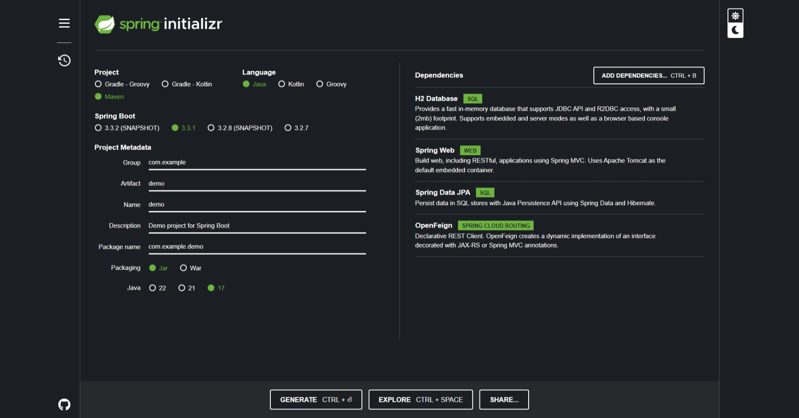

# Design Patterns com Java: Dos Clássicos (GoF) ao Spring Framework

> Padrões de Projeto: Soluções consolidadas para problemas recorrentes no desenvolvimento e manutenção de software orientado a objetos.

- [Padrões de Projeto](./Patterns/README.md) - Solucões Reutilizáveis de Software Orientado a Objetos

## Exemplo Spring

## Projeto Wizard

Simulador de um Wizard D&D utilizando padrões **Command** e **Strategy** para implementar suas ações.
